<!--
  Profile README for github.com/abosalah-dev/abosalah-dev
  Widths 370/490 keep the portrait and info card the same height -- if you change
  the info card's H in scripts/make_info_card.py, re-match these.
-->

<table>
<tr>
<td valign="top"></td>
<td valign="top"></td>
</tr>
</table>

## Ahmed Salah

**Software Engineer · Full-Stack Developer · AI Engineer · DevOps**

 

<!-- animated contribution graph, refreshed daily by the workflow -->

